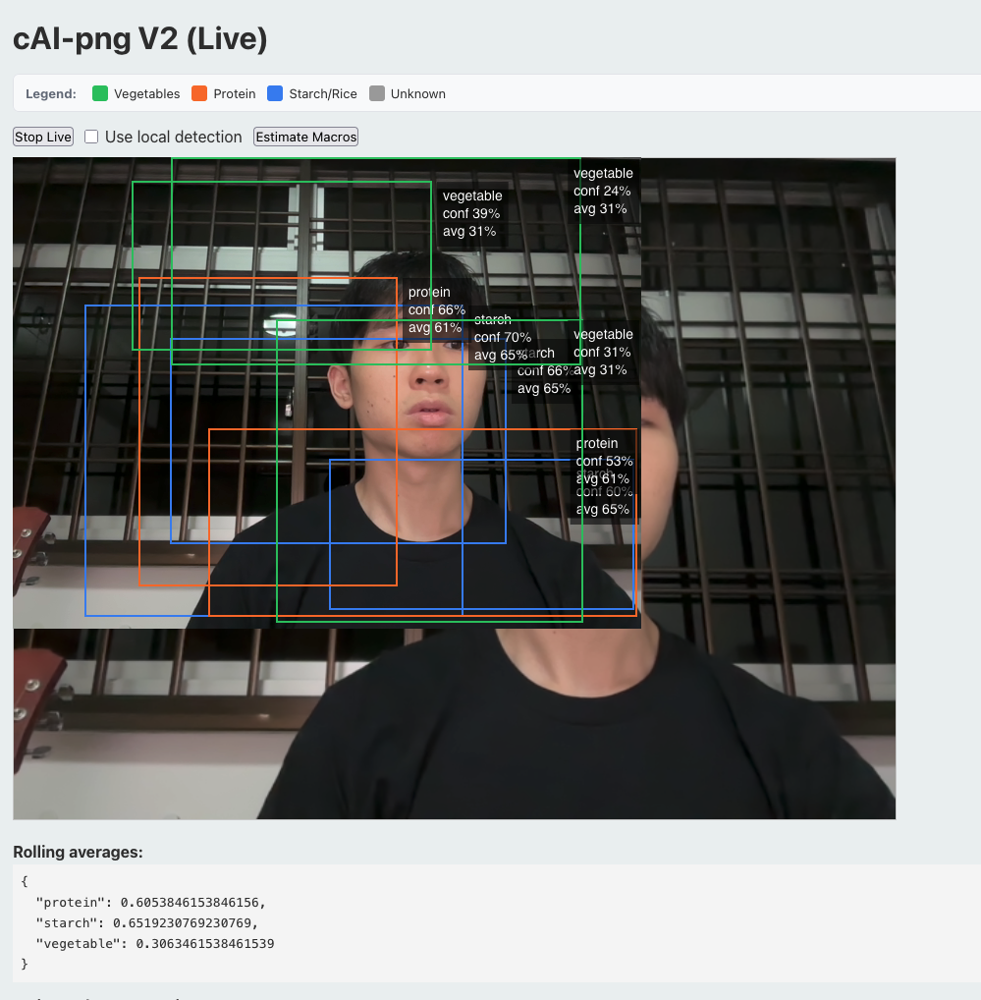
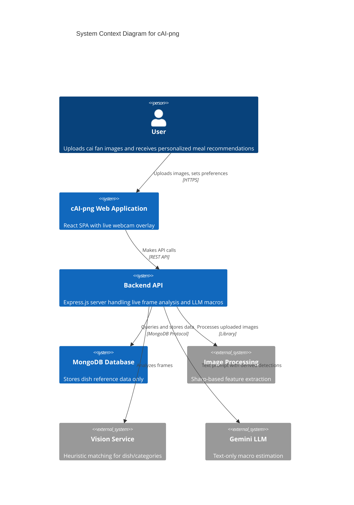
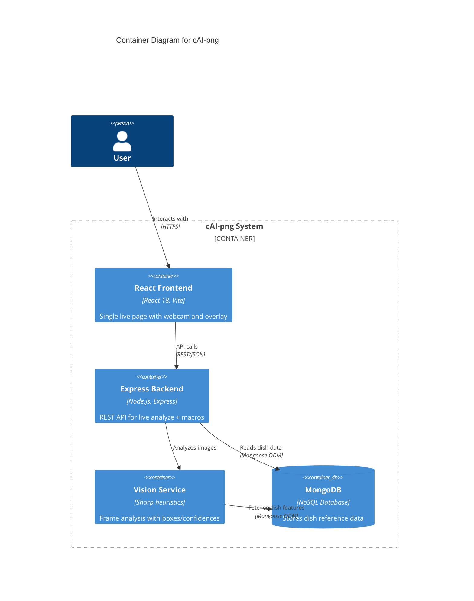
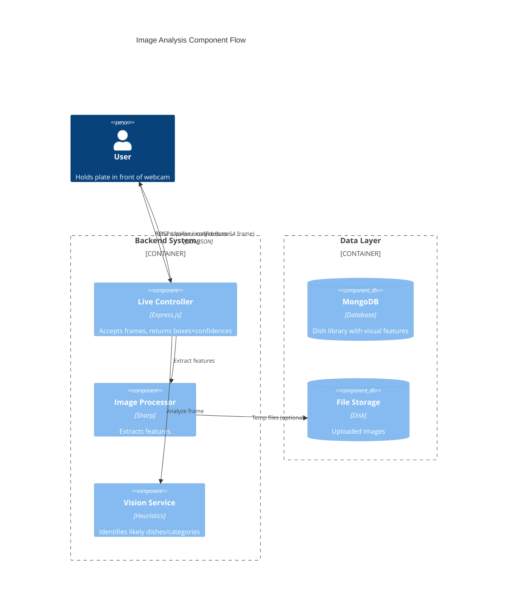
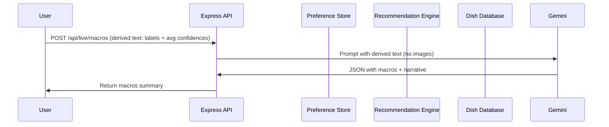
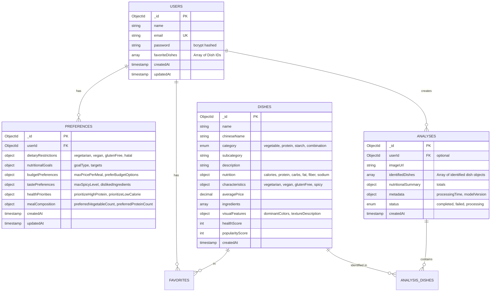

[](https://github.com/gongahkia/caipng/releases/tag/1.0.0)
[](https://github.com/gongahkia/caipng/releases/tag/2.0.0)

# `cAI-png`

[Cai Fan](https://en.wikipedia.org/wiki/Economy_rice) [Macros](https://www.calculator.net/macro-calculator.html) Estimation Web App, [built](#architecture) atop a [Computer Vision](https://www.ibm.com/think/topics/computer-vision) Engine.

Available [backend endpoints](#architecture) are [here](#api-reference).

<div align="center">
  
</div>

## Stack

* Frontend: [React](https://react.dev), [Vite](https://vitejs.dev) 
* Backend: [Node.js](https://nodejs.org), [Express.js](https://expressjs.com), [Mongoose](https://mongoosejs.com)
* Database: [MongoDB](https://www.mongodb.com) 
* Computer Vision: [Sharp](https://sharp.pixelplumbing.com), [tfjs-node](https://www.npmjs.com/package/@tensorflow/tfjs-node) 
* LLM: [Gemini](https://ai.google.dev) 
* Package: [Docker](https://www.docker.com), [Docker Compose](https://docs.docker.com/compose/)

## Usage

The below instructions are for locally hosting `cAI-png`.

1. First execute the below.

```console
$ git clone https://github.com/gongahkia/caipng.git && cd caipng
```

2. Set up MongoDB [locally](https://www.mongodb.com/docs/manual/tutorial/install-mongodb-on-ubuntu/) or via [MongoDB Atlas](https://www.mongodb.com/cloud/atlas).

3. Create and fill up `backend/.env`.

```env
NODE_ENV=development
PORT=5000
MONGODB_URI=mongodb://localhost:27017/caipng
GEMINI_API_KEY=your_gemini_api_key
GEMINI_MODEL=gemini-1.5-flash
MAX_FILE_SIZE=10485760
UPLOAD_PATH=./uploads
CORS_ORIGIN=http://localhost:3000
```

4. Create and fill up `frontend/.env`.

```env
VITE_API_URL=http://localhost:5000/api
VITE_MAX_IMAGE_SIZE=10485760
```

4. Install dependencies and seed database:

```console
$ cd backend && npm install
$ npm run seed
$ cd ../frontend && npm install
$ cd ..
```

5. Run with Docker Compose or the Makefile.

```console
$ docker-compose up -d
$ docker-compose exec backend npm run seed
$ make install
$ make docker-up
```

* Frontend: http://localhost:3000
* Backend API: http://localhost:5000
* Health Check: http://localhost:5000/health

## Screenshot



## Architecture

* Browser captures frames
* Backend runs heuristic detection and returns bounding boxes with confidences at ~5–10 FPS
* Derived text summary is sent to Gemini to estimate macros
* No images are sent to the LLM

### System Context Diagram



### Container Diagram



### Live Analysis Flow



### Macros Estimation Flow



### Data Model



## API Reference

### Base URL
- **Development**: `http://localhost:5000`
- **Production**: `https://api.caipng.example.com`

### Endpoints

#### Health Check
```http
GET /health
```

**Response**:
```json
{
  "success": true,
  "message": "cAI-png server is running",
  "timestamp": "2024-01-01T12:00:00.000Z"
}
```

#### Get All Dishes
```http
GET /api/dishes?category=vegetable&vegetarian=true&page=1&limit=20
```

**Query Parameters**:
- `category` - Filter by category (vegetable, protein, starch, combination)
- `vegetarian` - Filter vegetarian dishes (true/false)
- `maxCalories` - Maximum calories
- `page` - Page number (default: 1)
- `limit` - Items per page (default: 20)
- `sortBy` - Sort field (e.g., nutrition.protein)
- `order` - Sort order (asc/desc)

**Response**:
```json
{
  "success": true,
  "count": 10,
  "totalPages": 3,
  "currentPage": 1,
  "data": [
    {
      "_id": "507f1f77bcf86cd799439011",
      "name": "Stir-Fried Bok Choy",
      "chineseName": "清炒白菜",
      "category": "vegetable",
      "nutrition": {
        "calories": 45,
        "protein": 2.5,
        "carbohydrates": 8,
        "fat": 1.2,
        "fiber": 2.5,
        "sodium": 250
      },
      "characteristics": {
        "isVegetarian": true,
        "isVegan": true,
        "isGlutenFree": true
      },
      "averagePrice": 1.50,
      "healthScore": 85
    }
  ]
}
```

#### Search Dishes
```http
GET /api/dishes/search?q=chicken
```

#### Live Analyze Frame
```http
POST /api/live/analyze
Content-Type: application/json

{
  "imageBase64": "data:image/jpeg;base64,..."
}
```

Response:
```json
{
  "success": true,
  "detections": [
    { "label": "vegetable", "confidence": 0.76, "box": { "x": 100, "y": 60, "width": 180, "height": 140 } }
  ]
}
```

#### Estimate Macros (LLM)
```http
POST /api/live/macros
Content-Type: application/json

{
  "derivedText": "Detected items (rolling):\nvegetable: avgConfidence=78%\nprotein: avgConfidence=65%\n"
}
```

Response:
```json
{
  "success": true,
  "macros": { "calories": 640, "protein": 28, "carbs": 70, "fat": 20 },
  "narrative": "Estimated based on detected categories and common portions."
}
```

#### User Authentication
```http
POST /api/users/register
POST /api/users/login
GET /api/users/me (requires auth)
POST /api/users/favorites/:dishId (requires auth)
DELETE /api/users/favorites/:dishId (requires auth)
```

#### Preferences Management
```http
POST /api/preferences
GET /api/preferences/:userId
PUT /api/preferences/dietary
PUT /api/preferences/nutritional-goals
PUT /api/preferences/budget
```
